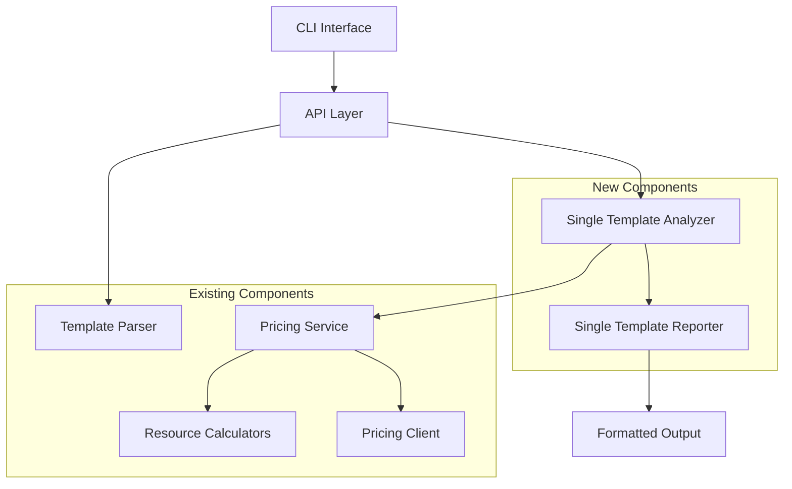

# Design Document: Single Template Cost Analysis

## Overview

This design extends the cdk-cost-analyzer tool to support analyzing a single CloudFormation template for estimated monthly costs. The feature leverages the existing pricing service architecture while introducing new components for single template processing and specialized reporting.

The solution introduces a new `analyze` CLI command and `analyzeSingleTemplate` API function that processes a single template, calculates costs for all resources, and provides detailed cost breakdowns without requiring a comparison baseline.

## Architecture

The single template analysis feature integrates with the existing architecture through these key components:



The design maintains separation of concerns by:
- Reusing existing template parsing and pricing calculation logic
- Creating specialized components for single template analysis workflow
- Extending the reporter to handle single template output formats
- Maintaining backward compatibility with existing comparison functionality

## Components and Interfaces

### SingleTemplateAnalyzer

A new service class responsible for orchestrating single template cost analysis:

```typescript
interface SingleTemplateAnalyzer {
  analyzeCosts(template: string, region: string, config?: AnalysisConfig): Promise<SingleTemplateCostResult>;
}

interface AnalysisConfig {
  usageAssumptions?: UsageAssumptionsConfig;
  excludedResourceTypes?: string[];
  cacheConfig?: CacheConfig;
}

interface SingleTemplateCostResult {
  totalMonthlyCost: number;
  currency: string;
  resourceCosts: ResourceCost[];
  costBreakdown: CostBreakdown;
  summary: string;
}

interface CostBreakdown {
  byResourceType: ResourceTypeCost[];
  byConfidenceLevel: ConfidenceLevelCost[];
  assumptions: string[];
}

interface ResourceTypeCost {
  resourceType: string;
  count: number;
  totalCost: number;
  resources: ResourceCost[];
}

interface ConfidenceLevelCost {
  confidence: 'high' | 'medium' | 'low' | 'unknown';
  count: number;
  totalCost: number;
}
```

### Extended API Interface

The existing API will be extended with a new function:

```typescript
interface AnalyzeSingleTemplateOptions {
  template: string;
  region?: string;
  format?: 'text' | 'json' | 'markdown';
  config?: AnalysisConfig;
}

export async function analyzeSingleTemplate(
  options: AnalyzeSingleTemplateOptions
): Promise<SingleTemplateCostResult>;
```

### CLI Command Extension

A new `analyze` command will be added to the CLI:

```bash
cdk-cost-analyzer analyze <template> [options]
```

Options:
- `--region <region>`: AWS region for pricing (default: eu-central-1)
- `--format <format>`: Output format: text|json|markdown (default: text)
- `--config <path>`: Path to configuration file
- `--debug`: Enable verbose debug logging

### SingleTemplateReporter

A specialized reporter for single template analysis results:

```typescript
interface SingleTemplateReporter {
  generateReport(
    result: SingleTemplateCostResult,
    format: ReportFormat,
    options?: SingleTemplateReportOptions
  ): string;
}

interface SingleTemplateReportOptions {
  showBreakdown?: boolean;
  showAssumptions?: boolean;
  groupByType?: boolean;
  sortBy?: 'cost' | 'name' | 'type';
}
```

## Data Models

### Resource Cost Model

Extends the existing ResourceCost interface to include additional metadata:

```typescript
interface EnhancedResourceCost extends ResourceCost {
  properties?: Record<string, any>;
  region: string;
  calculatedAt: Date;
}
```

### Analysis Result Model

```typescript
interface SingleTemplateCostResult {
  totalMonthlyCost: number;
  currency: string;
  resourceCosts: EnhancedResourceCost[];
  costBreakdown: CostBreakdown;
  summary: string;
  metadata: AnalysisMetadata;
}

interface AnalysisMetadata {
  templateHash: string;
  region: string;
  analyzedAt: Date;
  resourceCount: number;
  supportedResourceCount: number;
  unsupportedResourceCount: number;
}
```

## Correctness Properties

*A property is a characteristic or behavior that should hold true across all valid executions of a system-essentially, a formal statement about what the system should do. Properties serve as the bridge between human-readable specifications and machine-verifiable correctness guarantees.*

Now I need to use the prework tool to analyze the acceptance criteria before writing the correctness properties:

<function_calls>
<invoke name="prework">
<parameter name="featureName">single-template-analysis

### Property 1: Template Processing Completeness
*For any* valid CloudFormation template, analyzing it should calculate costs for all supported resources and return a complete cost breakdown with total monthly cost.
**Validates: Requirements 1.1, 1.2**

### Property 2: Output Format Consistency  
*For any* single template analysis result, the output should include individual resource costs with logical IDs, resource types, confidence levels, and assumptions, properly grouped by type and sorted by cost in descending order.
**Validates: Requirements 1.3, 3.1, 3.2, 3.3, 3.4, 3.5, 7.1, 7.2**

### Property 3: Unsupported Resource Handling
*For any* template containing unsupported resource types, those resources should appear in the output with zero cost and unknown confidence level.
**Validates: Requirements 1.4, 7.3**

### Property 4: Error Handling Consistency
*For any* invalid input (malformed templates, missing files, invalid configuration), the system should return descriptive error messages and appropriate exit codes without crashing.
**Validates: Requirements 1.5, 2.5, 4.4, 6.4**

### Property 5: CLI Command Behavior
*For any* valid template file and CLI options, the analyze command should execute single template analysis and produce output in the requested format.
**Validates: Requirements 2.1, 2.3, 6.5**

### Property 6: Regional Pricing Accuracy
*For any* region parameter provided, the pricing calculations should use region-specific pricing data and note regional variations in assumptions.
**Validates: Requirements 2.2, 5.4, 7.4**

### Property 7: Debug Logging Activation
*For any* analysis run with debug flag enabled, verbose logging should be produced for pricing API calls.
**Validates: Requirements 2.4**

### Property 8: Configuration Application
*For any* valid configuration provided (usage assumptions, excluded resource types, cache settings), the analysis should apply these settings and reflect them in the results.
**Validates: Requirements 4.3, 5.1, 5.2, 5.3**

### Property 9: API Interface Consistency
*For any* valid template processed through the API, the result should have a consistent structure with total cost, resource breakdown, and metadata.
**Validates: Requirements 4.2**

### Property 10: Resource Cleanup
*For any* completed analysis, all connections and resources should be properly cleaned up to prevent hanging connections.
**Validates: Requirements 4.5**

### Property 11: Configuration Graceful Degradation
*For any* invalid or missing configuration, the system should use default values and continue analysis without failure.
**Validates: Requirements 5.5**

### Property 12: CI/CD Environment Support
*For any* CI/CD environment execution, the single template analysis should work without requiring baseline templates and provide appropriate exit codes.
**Validates: Requirements 6.1, 6.3**

### Property 13: AWS Credentials Error Messaging
*For any* execution with missing AWS credentials, helpful error messages with setup instructions should be displayed.
**Validates: Requirements 6.2**

### Property 14: Usage Assumption Transparency
*For any* cost calculation that uses usage assumptions, those assumptions should be clearly explained in the output.
**Validates: Requirements 7.5**

### Property 15: Template Parser Robustness
*For any* CloudFormation template (JSON/YAML, with functions, parameters, or nested stacks), the parser should handle it appropriately or provide specific error messages.
**Validates: Requirements 8.1, 8.2, 8.3, 8.4, 8.5**

### Property 16: GitHub Integration Completeness
*For any* implementation task created, corresponding GitHub issues should be generated with complete information, appropriate labels, and dependency references.
**Validates: Requirements 9.1, 9.2, 9.3, 9.4, 9.5**

### Property 17: Test Result Consistency
*For any* demo template analyzed multiple times with the same configuration, the results should be consistent.
**Validates: Requirements 10.4**

### Property 18: Authentication Method Preference
*For any* AWS operation requiring credentials, OIDC should be used over stored access keys when available.
**Validates: Requirements 10.5**

## Error Handling

The single template analysis feature implements comprehensive error handling across multiple layers:

### Template Processing Errors
- **Invalid JSON/YAML**: Descriptive parsing errors with line numbers when possible
- **Missing Templates**: Clear file not found errors with suggested paths
- **Malformed CloudFormation**: Specific validation errors for CloudFormation structure issues
- **Unsupported Resources**: Graceful handling with zero cost and clear indication

### Pricing Service Errors
- **API Failures**: Retry logic with exponential backoff for transient failures
- **Missing Pricing Data**: Fallback to zero cost with unknown confidence
- **Rate Limiting**: Automatic retry with appropriate delays
- **Network Issues**: Timeout handling and connection cleanup

### Configuration Errors
- **Invalid Config Files**: Validation with specific error messages
- **Missing AWS Credentials**: Helpful setup instructions for different environments
- **Invalid Regions**: Clear error messages with supported region list
- **Permission Issues**: Specific IAM permission guidance

### CLI Error Handling
- **Exit Codes**: 0 for success, 1 for user errors, 2 for system errors
- **Error Messages**: Consistent formatting with actionable guidance
- **Debug Mode**: Enhanced error information when debug flag is enabled

## Testing Strategy

The testing strategy employs a dual approach combining unit tests for specific scenarios and property-based tests for comprehensive coverage:

### Unit Testing Approach
Unit tests focus on specific examples, edge cases, and integration points:
- **Template Parsing**: Test specific CloudFormation templates with known structures
- **Error Conditions**: Test specific error scenarios (missing files, invalid JSON, etc.)
- **CLI Integration**: Test command-line argument parsing and output formatting
- **Configuration Loading**: Test specific configuration file formats and validation
- **GitHub Integration**: Test issue creation and status updates with mock GitHub API

### Property-Based Testing Approach
Property-based tests verify universal properties across randomized inputs:
- **Template Processing**: Generate random valid CloudFormation templates and verify cost calculation completeness
- **Output Formatting**: Test output consistency across different template structures and formats
- **Configuration Handling**: Generate random configuration combinations and verify proper application
- **Error Handling**: Generate invalid inputs and verify consistent error responses
- **Regional Pricing**: Test pricing consistency across different regions and resource types

### Testing Configuration
- **Property Test Iterations**: Minimum 100 iterations per property test
- **Test Framework**: Jest for unit tests, fast-check for property-based testing
- **Test Tagging**: Each property test tagged with format: **Feature: single-template-analysis, Property {number}: {property_text}**
- **Coverage Requirements**: Minimum 90% code coverage for new components
- **Integration Testing**: End-to-end tests using demo templates from testaccount01

### Verification Testing
- **Demo Templates**: Use templates from demo/cdk.out.1 and demo/cdk.out.2 directories
- **AWS Profile**: All tests use testaccount01 profile for authentication
- **OIDC Authentication**: GitHub Actions authenticate using OIDC to testaccount01
- **Consistency Verification**: Same template should produce identical results across runs
- **Performance Testing**: Verify analysis completes within reasonable time limits

The testing strategy ensures both correctness through property-based testing and practical reliability through comprehensive unit testing of specific scenarios and edge cases.